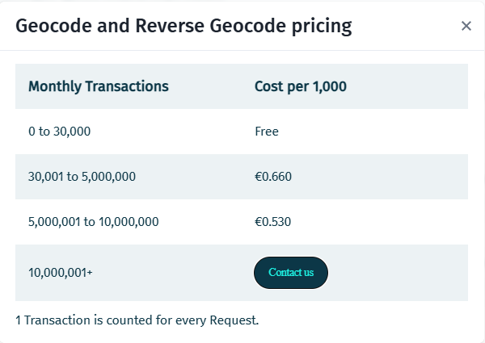
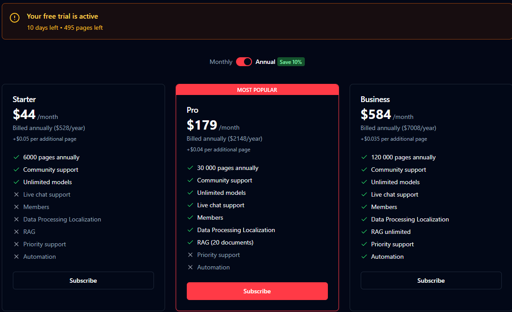

# Serviços externos utilizados no `AETC`:

> [Here Maps API](https://www.here.com/docs/bundle/wego-pro-user-guide/page/README.html)

  Utilizado como fall-back do serviço [`Brasil API`](https://brasilapi.com.br/) para obter coordenadas geográficas a partir do código `CEP`.

  [**FreeTier**](https://www.here.com/get-started/pricing#here---platform---pricing---page-title): 30.000 requisições mensais.
  

> [GraphHopper API](https://docs.graphhopper.com/openapi/routing)

  Utilizado para gerar rotas entre dois endereços.

  [**FreeTier**](https://graphhopper.com/dashboard/subscription): 500 requisições com reset diário.

> [Mindee OCR API](https://developers.mindee.com/docs/dotnet-ocr-sdk)

Utilizado para fazer a leitura `OCR` de CNH.

[**FreeTier**](https://app.mindee.com/settings?tab=billing):
25 páginas mensais.
